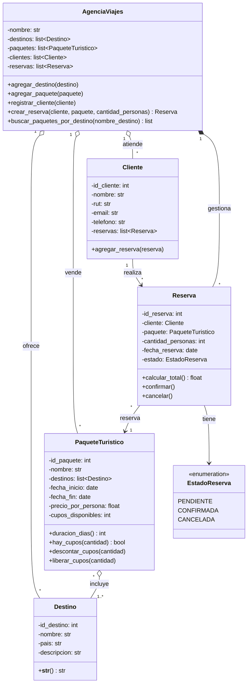

Aquí tienes un diseño para el sistema de la agencia de viajes: primero el diagrama de clases y después su implementación en Python.

## Diagrama de clases (Mermaid)



**Cómo leer las relaciones:**

| Relación | Tipo | Por qué |
|---|---|---|
| Paquete con Destino | Agregación (1..*) | Un paquete incluye uno o más destinos, y el destino existe aunque el paquete se borre. |
| Cliente con Reserva | Asociación (1 a *) | Un cliente puede tener muchas reservas, y cada reserva es de un solo cliente. |
| Reserva con Paquete | Asociación (* a 1) | Cada reserva es de un paquete, y un paquete puede tener muchas reservas. |
| Agencia con Reserva | Composición | La agencia crea las reservas y las administra. |

## Implementación en Python

```python
from dataclasses import dataclass, field
from datetime import date
from enum import Enum


class EstadoReserva(Enum):
    PENDIENTE = "Pendiente"
    CONFIRMADA = "Confirmada"
    CANCELADA = "Cancelada"


@dataclass
class Destino:
    id_destino: int
    nombre: str
    pais: str
    descripcion: str = ""

    def __str__(self):
        return f"{self.nombre} ({self.pais})"


@dataclass
class PaqueteTuristico:
    id_paquete: int
    nombre: str
    destinos: list[Destino]
    fecha_inicio: date
    fecha_fin: date
    precio_por_persona: float
    cupos_disponibles: int

    def __post_init__(self):
        if not self.destinos:
            raise ValueError("El paquete debe incluir al menos un destino.")
        if self.fecha_fin < self.fecha_inicio:
            raise ValueError("La fecha de fin no puede ser anterior a la de inicio.")
        if self.precio_por_persona < 0 or self.cupos_disponibles < 0:
            raise ValueError("Precio y cupos no pueden ser negativos.")

    def duracion_dias(self) -> int:
        return (self.fecha_fin - self.fecha_inicio).days + 1

    def hay_cupos(self, cantidad: int) -> bool:
        return cantidad <= self.cupos_disponibles

    def descontar_cupos(self, cantidad: int):
        if not self.hay_cupos(cantidad):
            raise ValueError(f"No hay cupos suficientes en '{self.nombre}'.")
        self.cupos_disponibles -= cantidad

    def liberar_cupos(self, cantidad: int):
        self.cupos_disponibles += cantidad


@dataclass
class Cliente:
    id_cliente: int
    nombre: str
    rut: str
    email: str
    telefono: str = ""
    reservas: list["Reserva"] = field(default_factory=list)

    def agregar_reserva(self, reserva: "Reserva"):
        self.reservas.append(reserva)


@dataclass
class Reserva:
    id_reserva: int
    cliente: Cliente
    paquete: PaqueteTuristico
    cantidad_personas: int
    fecha_reserva: date = field(default_factory=date.today)
    estado: EstadoReserva = EstadoReserva.PENDIENTE

    def __post_init__(self):
        if self.cantidad_personas <= 0:
            raise ValueError("La reserva debe ser para al menos una persona.")

    def calcular_total(self) -> float:
        return self.paquete.precio_por_persona * self.cantidad_personas

    def confirmar(self):
        if self.estado != EstadoReserva.PENDIENTE:
            raise ValueError("Solo se puede confirmar una reserva pendiente.")
        self.estado = EstadoReserva.CONFIRMADA

    def cancelar(self):
        if self.estado == EstadoReserva.CANCELADA:
            raise ValueError("La reserva ya está cancelada.")
        self.estado = EstadoReserva.CANCELADA
        self.paquete.liberar_cupos(self.cantidad_personas)


class AgenciaViajes:
    def __init__(self, nombre: str):
        self.nombre = nombre
        self.destinos: list[Destino] = []
        self.paquetes: list[PaqueteTuristico] = []
        self.clientes: list[Cliente] = []
        self.reservas: list[Reserva] = []

    def agregar_destino(self, destino: Destino):
        self.destinos.append(destino)

    def agregar_paquete(self, paquete: PaqueteTuristico):
        self.paquetes.append(paquete)

    def registrar_cliente(self, cliente: Cliente):
        self.clientes.append(cliente)

    def crear_reserva(self, cliente: Cliente, paquete: PaqueteTuristico,
                      cantidad_personas: int) -> Reserva:
        reserva = Reserva(len(self.reservas) + 1, cliente, paquete, cantidad_personas)
        paquete.descontar_cupos(cantidad_personas)
        cliente.agregar_reserva(reserva)
        self.reservas.append(reserva)
        return reserva

    def buscar_paquetes_por_destino(self, nombre_destino: str) -> list[PaqueteTuristico]:
        nombre = nombre_destino.lower()
        return [p for p in self.paquetes
                if any(d.nombre.lower() == nombre for d in p.destinos)]


if __name__ == "__main__":
    agencia = AgenciaViajes("Viajes del Sur")

    cusco = Destino(1, "Cusco", "Perú", "Ciudad imperial inca")
    machu = Destino(2, "Machu Picchu", "Perú", "Santuario histórico")
    agencia.agregar_destino(cusco)
    agencia.agregar_destino(machu)

    paquete = PaqueteTuristico(1, "Ruta Inca", [cusco, machu],
                               date(2026, 11, 10), date(2026, 11, 15),
                               450_000, 10)
    agencia.agregar_paquete(paquete)

    ana = Cliente(1, "Ana Pérez", "12.345.678-9", "ana@mail.com")
    agencia.registrar_cliente(ana)

    reserva = agencia.crear_reserva(ana, paquete, 2)
    reserva.confirmar()
    assert reserva.calcular_total() == 900_000
    assert paquete.cupos_disponibles == 8
    assert paquete.duracion_dias() == 6

    reserva.cancelar()
    assert paquete.cupos_disponibles == 10
    assert agencia.buscar_paquetes_por_destino("cusco") == [paquete]

    print(f"Reserva {reserva.id_reserva}: {ana.nombre}, {paquete.nombre}, "
          f"total ${reserva.calcular_total():,.0f}, estado {reserva.estado.value}")
```

**Cómo funciona:**
- Cuando se crea una reserva se descuentan los cupos del paquete, y cuando se cancela se devuelven. Así nunca se venden más plazas de las que hay.
- Los estados de la reserva usan un `Enum`. De esa forma no se puede poner un estado inválido, como un texto mal escrito.
- El bloque `__main__` sirve de prueba rápida. Si alguna regla se rompe, los `assert` fallan.

No incluí pagos, usuarios del sistema ni persistencia en base de datos. Se pueden agregar después como clases `Pago` y `Usuario`, o con un repositorio en `sqlite3`. Si quieres, también te paso el diagrama en PlantUML para usarlo en draw.io o StarUML.
