## 1) Diagrama de clases (PlantUML)

```plantuml
@startuml ViajesAventura_Dominio
skinparam classAttributeIconSize 0
skinparam shadowing false
hide empty members
title Viajes Aventura · Modelo de dominio v1 (alcance §6)

' ===================== Usuarios y seguridad =====================

enum Accion {
  GESTIONAR_CATALOGO
  RESERVAR
  CONSULTAR_RESERVAS_PROPIAS
}

abstract class Usuario {
  # nombre : str
  - correo : str {unique}
  - hash_contrasena : str
  # __init__(nombre : str, correo : str, hash_contrasena : str)
  # {static} hashear(contrasena : str) : str
  + correo() : str
  + verificar_contrasena(contrasena : str) : bool
  ~ hash_contrasena() : str
  + {abstract} puede(accion : Accion) : bool
  + {abstract} resumen() : str
}

class Cliente {
  - rut : Rut
  - telefono : str
  - reservas : list[Reserva]
  ~ __init__(nombre : str, rut : Rut, correo : str, telefono : str, hash_contrasena : str)
  + {static} registrar(nombre : str, rut : str, correo : str, telefono : str, contrasena : str) : Cliente
  + puede(accion : Accion) : bool
  + resumen() : str
  + reservas() : tuple[Reserva, ...]
  ~ agregar_reserva(reserva : Reserva) : None
  ~ rut() : Rut
  ~ telefono() : str
}

class Administrador {
  + {static} crear(nombre : str, correo : str, contrasena : str) : Administrador
  + puede(accion : Accion) : bool
  + resumen() : str
}

class Rut <<value object>> {
  - cuerpo : int
  - dv : str
  + {static} desde_texto(texto : str) : Rut
  ~ valor() : str
  + __eq__(otro : object) : bool
  + __repr__() : str
}

class PasswordHasher <<argon2-cffi>> {
  + hash(contrasena : str) : str
  + verify(hash : str, contrasena : str) : bool
}

class Exception <<builtin>>

class ReglaNegocioError {
  + regla : str
  + __init__(regla : str, mensaje : str)
}

' ===================== Catálogo, paquetes y reservas =====================

class Catalogo {
  - destinos : dict[str, Destino]
  - paquetes : list[Paquete]
  + registrar_destino(solicitante : Usuario, destino : Destino) : None
  + buscar_destino(nombre : str) : Destino
  + listar_destinos(incluir_no_disponibles : bool = False) : list[Destino]
  + retirar_destino(solicitante : Usuario, nombre : str) : bool
  + crear_paquete(solicitante : Usuario, nombre : str, nombres_destinos : list[str], fecha_salida : date, fecha_regreso : date, cupo_maximo : int, margen : Decimal = Decimal("20")) : Paquete
  + paquetes_disponibles(hoy : date) : list[Paquete]
}

class Destino {
  - nombre : str {unique}
  - zona : str
  - descripcion : str
  - duracion_dias : int
  - costo_base : int
  - disponible : bool = True
  + __init__(nombre : str, zona : str, descripcion : str, duracion_dias : int, costo_base : int)
  + nombre() : str
  + costo_base() : int
  + esta_disponible() : bool
  + modificar(zona : str, descripcion : str, duracion_dias : int, costo_base : int) : None
  ~ marcar_no_disponible() : None
  + resumen() : str
}

class Paquete {
  - nombre : str
  - destinos : tuple[Destino, ...]
  - fecha_salida : date
  - fecha_regreso : date
  - cupo_maximo : int
  - margen : Decimal = Decimal("20")
  - precio_por_persona : int | None = None
  - reservas : list[Reserva]
  ~ __init__(nombre : str, destinos : list[Destino], fecha_salida : date, fecha_regreso : date, cupo_maximo : int, margen : Decimal)
  + calcular_precio() : int
  + publicar() : None
  + esta_publicado() : bool
  + precio() : int
  + incluye(destino : Destino) : bool
  + cupo_disponible() : int
  + esta_disponible(hoy : date) : bool
  + reservar(cliente : Cliente, personas : int, hoy : date) : Reserva
  + resumen() : str
}

class Reserva {
  - cliente : Cliente
  - paquete : Paquete
  - fecha_emision : date
  - cantidad_personas : int
  - total : int
  ~ __init__(cliente : Cliente, paquete : Paquete, cantidad_personas : int, fecha_emision : date)
  + paquete() : Paquete
  + fecha_emision() : date
  + cantidad_personas() : int
  + total() : int
  + resumen() : str
}

' ===================== Relaciones =====================

Usuario <|-- Cliente
Usuario <|-- Administrador
Exception <|-- ReglaNegocioError

Catalogo "1" *-- "0..*" Destino : contiene >
Catalogo "1" *-- "0..*" Paquete : publica >
Paquete "0..*" o-- "2..5 {unique}" Destino : combina >
Paquete "1" -- "0..*" Reserva : registra >
Cliente "1" -- "0..*" Reserva : emite >
Cliente "1" *-- "1" Rut : identifica >

Usuario ..> Accion : <<use>>
Usuario ..> PasswordHasher : <<use>>
Catalogo ..> Usuario : <<use>> solicitante

' ===================== Notas de reglas =====================

note right of Paquete
  R3: 2..5 destinos, sin repetir; todos disponibles al crear (R8)
  R5: fecha_regreso > fecha_salida; cupo_maximo > 0
  R6: precio = Σ costo_base × (1 + margen/100), redondeo al peso; margen ≥ 0
  R7: publicar() congela precio_por_persona
  R14: cupo_disponible() = cupo_maximo − Σ reservas.cantidad_personas
  R15: reservar() exige hoy < fecha_salida
end note

note bottom of Reserva
  R13: total = paquete.precio() × cantidad_personas,
  se fija en el constructor y no tiene setter.
  R16: cantidad_personas ≥ 1
end note

note left of Rut
  desde_texto() valida formato y dígito verificador (módulo 11).
  __repr__() devuelve "Rut(***)": nunca se filtra a logs ni trazas (R17).
end note

note right of Catalogo
  R1: nombre de destino único (normalizado: casefold + espacios).
  R8: retirar_destino() elimina si ningún paquete lo incluye (True);
  si alguno lo incluye, lo marca no disponible (False).
  Toda operación de gestión exige solicitante.puede(GESTIONAR_CATALOGO).
end note

note bottom of ReglaNegocioError
  Toda validación lanza esta excepción con el código R#.
  Sus mensajes nunca incluyen RUT ni teléfono (R17).
end note

legend bottom
  Visibilidad: + pública · - privada (_atributo + @property de solo lectura)
  # protegida (subclases) · ~ de paquete (solo la capa de persistencia la usa)
endlegend
@enduml
```

## 2) Clase → frase del caso que la origina

| Clase | Frase del caso | Ubicación |
|---|---|---|
| `Destino` | «Un destino es un lugar con un servicio ya cotizado: la agencia conoce cuánto le cuesta llevar a una persona allí.» / «Un destino tiene nombre, zona, descripción, duración en días y un costo base por persona.» | §1.1, R1 |
| `Paquete` | «Un paquete reúne varios destinos bajo un nombre comercial, con una fecha de salida, una de regreso y un cupo máximo de personas.» | §1.2, R5 |
| `Reserva` | «Una reserva corresponde a un cliente y a un paquete, y registra la fecha en que se emitió, la cantidad de personas y el total cobrado.» | R12 |
| `Catalogo` | Administrador: «Mantiene el catálogo de destinos, arma los paquetes, fija los cupos y publica las temporadas.» / «[…] se elimina del catálogo» | §1.3, R1, R8 |
| `Usuario` (abstracta) | Tabla «Quiénes participan» con dos roles (Cliente y Administrador) / «registro y autenticación de clientes» / «Seguridad del sistema: autenticación» | §1.3, §6 |
| `Cliente` | «Un cliente se registra con nombre, RUT, correo electrónico, teléfono y contraseña. El correo identifica al cliente y no se repite.» | R9 |
| `Administrador` | «Administrador: Mantiene el catálogo de destinos, arma los paquetes, fija los cupos y publica las temporadas. Hoy es uno de los socios.» | §1.3 |
| `Rut` | «Un cliente se registra con nombre, RUT […]» / «El RUT y el teléfono de un cliente son datos sensibles: no se muestran en listados ni en mensajes de error.» | R9, R17 |
| `Accion` (enumeración) | «Solo un cliente autenticado puede reservar y consultar reservas» / vacío declarado: «ni quién puede modificar el catálogo» | R11, recuadro §6 |
| `ReglaNegocioError` | «validación de todo dato ingresado» / «no se muestran […] en mensajes de error» | §6, R17 |
| `PasswordHasher` (externa, argon2-cffi) | «La contraseña nunca se almacena tal como el cliente la escribió.» + requisito de usar una librería especializada | R10 |

## 3) Relaciones

| # | Relación | Tipo | Multiplicidad | Origen |
|---|---|---|---|---|
| 1 | `Cliente` → `Usuario` | Generalización | (no aplica) | §1.3, R9 |
| 2 | `Administrador` → `Usuario` | Generalización | (no aplica) | §1.3 |
| 3 | `ReglaNegocioError` → `Exception` | Generalización | (no aplica) | §6 (validación), R17 |
| 4 | `Catalogo` contiene `Destino` | Composición | 1 Catalogo, 0..* Destino | §1.3, R1 («no se repite en el catálogo»), R8 («se elimina del catálogo») |
| 5 | `Catalogo` publica `Paquete` | Composición | 1 Catalogo, 0..* Paquete | §1.3 («arma los paquetes… publica las temporadas»), R7 |
| 6 | `Paquete` combina `Destino` | Agregación | 0..* Paquete, 2..5 Destino {unique} | R3 (2 a 5, sin repetir), R4 (un destino en varios paquetes), R8 (destinos sin paquete) |
| 7 | `Paquete` registra `Reserva` | Asociación (bidireccional) | 1 Paquete, 0..* Reserva | R12, R14 (el cupo se calcula sobre sus reservas) |
| 8 | `Cliente` emite `Reserva` | Asociación (bidireccional) | 1 Cliente, 0..* Reserva | R11 (cada cliente ve solo las suyas), R12 |
| 9 | `Cliente` tiene `Rut` | Composición | 1 Cliente, 1 Rut | R9, R17 |
| 10 | `Usuario` usa `Accion` | Dependencia | (no aplica) | R11, vacío «quién puede modificar el catálogo» (§6) |
| 11 | `Catalogo` usa `Usuario` (solicitante) | Dependencia | (no aplica) | §1.3 (el administrador mantiene el catálogo), supuesto D14 |
| 12 | `Usuario` usa `PasswordHasher` | Dependencia | (no aplica) | R10 |

Las relaciones 10 a 12 son dependencias de uso: no tienen multiplicidad porque no son vínculos estructurales entre instancias. Se incluyen porque dejan a la vista dónde se aplican la autorización y el hash.

## 4) Decisiones de diseño

**Dónde se ven los cuatro pilares**

| Pilar | Dónde está en el modelo |
|---|---|
| Encapsulamiento | Todos los atributos son privados (`-`). `Reserva` no tiene setters (R13). El hash, el RUT y el teléfono solo tienen accesores de paquete (`~`) para la persistencia. Los constructores de `Paquete` y `Reserva` son `~`, así que solo se crean por `Catalogo.crear_paquete()` y `Paquete.reservar()`, que es donde se validan las reglas. |
| Herencia | `Cliente` y `Administrador` heredan de `Usuario` el correo, el hash y la verificación de contraseña. `ReglaNegocioError` hereda de `Exception`. |
| Polimorfismo | `puede(accion)` y `resumen()` tienen una implementación distinta en cada subclase. `Catalogo` llama a `solicitante.puede(...)` sin saber de qué tipo es el usuario. |
| Abstracción | `Usuario` es abstracta y no se instancia. `Rut` oculta el algoritmo del dígito verificador. `Paquete` expone `cupo_disponible()` y `esta_disponible()` sin mostrar cómo se calculan. |

**Decisiones**

| # | Decisión | Alternativa descartada | Por qué |
|---|---|---|---|
| D1 | `Usuario` abstracta con dos subclases. | Una sola clase `Usuario` con un atributo `rol: str`. | Con un `rol` en texto, cada permiso se vuelve un `if rol == ...` repartido por el código, y el administrador cargaría campos `rut` y `telefono` vacíos. Con la herencia, los permisos quedan en un solo método polimórfico y solo el cliente tiene datos sensibles. |
| D2 | El precio se congela en `Paquete.publicar()` (`precio_por_persona`). | Recalcular siempre el precio a partir del costo actual de los destinos. | Recalcular es exactamente la causa de los 4 paquetes con precio distinto del cobrado (§2, §4, «Pista»). También descarté guardar una copia del costo de cada destino dentro del paquete: el caso no pide ese desglose y bastaba con congelar el precio. |
| D3 | `publicar()` es un paso separado de crear. | Que crear el paquete lo deje publicado. | R7 distingue los dos momentos. Además, el administrador puede revisar el precio calculado antes de ofrecerlo, lo que habría evitado el paquete publicado a la décima parte (§3.1). Un paquete sin publicar no se puede reservar. |
| D4 | `Reserva.total` se guarda (R13). | Derivarlo como `precio × personas` cada vez. | R12 dice que la reserva «registra el total cobrado»: es un hecho histórico. Guardarlo lo protege de cualquier cambio posterior en el paquete y responde al «nadie sabe cuál de los dos valores se cobró» (§2). |
| D5 | `Catalogo.retirar_destino()` decide entre eliminar y marcar no disponible (R8). | Borrar siempre, o marcar siempre como no disponible. | Si se borra siempre, los paquetes vendidos quedan sin contenido (§3.1). Si se marca siempre, se acumulan destinos muertos (los 4 que siguen visibles, §4). R8 pide los dos caminos y los dos necesitan saber si algún paquete usa el destino, algo que solo `Catalogo` conoce. |
| D6 | `Catalogo` compone `Destino`; `Paquete` solo agrega `Destino`. | Composición entre `Paquete` y `Destino`. | R4 permite que un destino esté en varios paquetes, y la composición exige un dueño único. El dueño del ciclo de vida es el catálogo («se elimina del catálogo»), y R8 garantiza que solo se borran destinos que ningún paquete referencia, así que nunca quedan agregaciones apuntando a algo borrado. |
| D7 | `Reserva` es una clase con dos asociaciones simples. | Composición bajo `Paquete` o bajo `Cliente`, o una clase asociación entre `Cliente` y `Paquete`. | La reserva depende de dos objetos y la composición admite un solo dueño. Una clase asociación UML implica un único vínculo por par cliente-paquete, pero un cliente puede reservar dos veces el mismo paquete (por ejemplo, sumar personas después). |
| D8 | `Paquete.reservar()` crea la reserva (constructor `~`). | Constructor público de `Reserva`. | Así R14, R15 y R16 se validan en un solo lugar, el que conoce el cupo. Nadie puede armar una reserva que se salte esas validaciones. |
| D9 | El cupo disponible se calcula a partir de las reservas (R14). | Un contador `cupo_restante` que se descuenta en cada reserva. | Un contador se desincroniza, como el cupo «en la cabeza y en el cuaderno» de Matías (§3.2). En sqlite3, la suma y el insert van en la misma transacción (`BEGIN IMMEDIATE`) para que dos reservas simultáneas no superen el cupo. |
| D10 | `hoy: date` se recibe como parámetro. | Llamar a `date.today()` dentro de `Paquete`. | Permite probar R15 de forma determinista. Supuesto declarado: un paquete que sale hoy ya no se reserva (`hoy < fecha_salida`), porque el grupo ya está en camino al punto de encuentro (§3.2). |
| D11 | Montos como `int` en pesos chilenos; margen como `Decimal`, redondeo `ROUND_HALF_UP` al peso. | `float` para todo. | El peso no tiene decimales y `float` arrastra errores de representación (`0.1 + 0.2`). El margen tiene default 20 y se valida `≥ 0` (R6). |
| D12 | `Rut` es un objeto valor; el teléfono es un `str` validado. | RUT como `str`, o crear también una clase `Telefono`. | El RUT tiene un algoritmo propio (módulo 11) y un `__repr__` que lo oculta, así que no se filtra a trazas ni logs (R17). El teléfono solo necesita una expresión regular, y una clase no aporta nada. Ninguno de los dos aparece en `resumen()` ni tiene accesor público. |
| D13 | El RUT y el teléfono se cifran en reposo en la capa de persistencia (por ejemplo, Fernet de `cryptography`). El dominio solo los expone con `~`. | Guardarlos en claro y confiar en los permisos del archivo `.db`. | El archivo `.db` se copia y se envía igual que la planilla de la que se queja Ignacio (§3.3). El cifrado queda fuera del dominio porque es un asunto de almacenamiento, no una regla del negocio. |
| D14 | Contraseñas con Argon2id (`argon2-cffi`). El hash solo tiene accesor `~`, y `verificar_contrasena()` delega la comparación en la librería. | `hashlib.sha256`, o `bcrypt`. | SHA-256 es rápido y, sin sal ni costo, queda expuesto a fuerza bruta. `bcrypt` es válido, pero trunca a 72 bytes, y Argon2id es la primera recomendación de OWASP. La validación del largo mínimo (supuesto: 8 caracteres) va en `hashear()`. |
| D15 | La autorización se hace en el dominio: `Catalogo` recibe `solicitante: Usuario` y consulta `puede()`. | Confiar en que el menú no muestre la opción. | Es defensa en profundidad: si el menú se equivoca, el dominio igual rechaza la operación. Supuesto para el vacío «quién puede modificar el catálogo»: solo `Administrador`. R11 se cumple por construcción, porque `Cliente.reservas()` devuelve únicamente las propias. |
| D16 | Una sola `ReglaNegocioError` con el código de la regla. | Una jerarquía de excepciones, una por regla. | El menú solo necesita distinguir entre un error esperado, que se muestra tal cual, y uno inesperado, que recibe un mensaje genérico sin traza. Los mensajes se redactan sin RUT ni teléfono (R17). |
| D17 | El nombre del destino es único después de normalizarlo (casefold y espacios colapsados). | Comparar el texto exacto. | Ataca los «destinos repetidos con nombres distintos» (§2). Se aplica en `Catalogo` y además con `UNIQUE` en sqlite. |
| D18 | Fuera del modelo a propósito. | Incluir `Temporada`, el estado de pago, la cancelación, el administrador como socio con datos propios, los informes, y los repositorios, el menú y la sesión. | `Temporada` se deduce de las fechas (R5) y el caso la usa solo como etiqueta. El pago y su verificación están fuera de alcance (§6): la planilla tenía «Estado», pero R12 no lo pide. La cancelación es un vacío del caso y no está en §6 (supuesto: en la v1 se gestiona fuera del sistema). «Cuántas personas han viajado» es un informe de gestión, fuera de §6. Los repositorios sqlite3, el menú y la sesión de login pertenecen a las capas de persistencia y aplicación, no al dominio. Supuesto: el administrador se crea con `Administrador.crear()` desde un script de instalación, sin registro público. |
